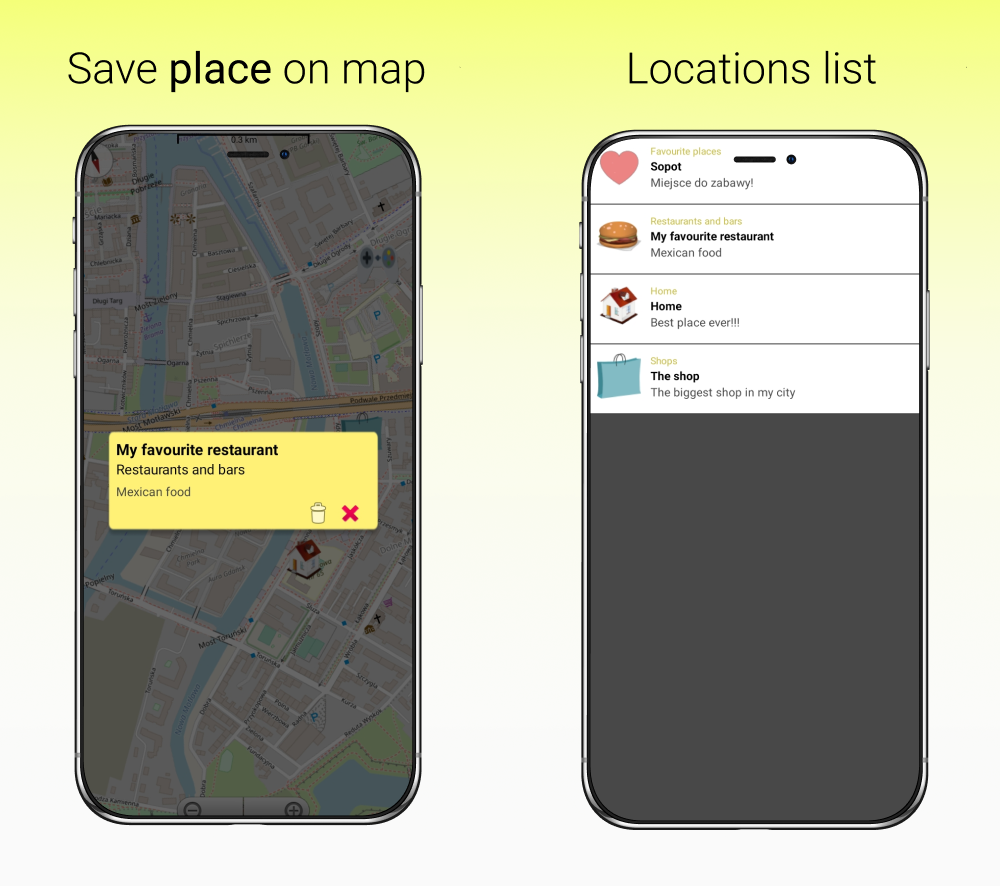

# android-app-saveplaceonmap

#### Android application for saving markers on the map

> The application allows you to save places on the map varies of categories. 
Location markers (locations) are saving in the phone memory. You can check the marker list - move to location, delete them and get information about added location. The application includes two language versions.

## 🔎 Demo
The application is available on the Play Store. https://play.google.com/store/apps/details?id=pl.edu.ug.saveplaceonmap

Youtube presentation:

## 🕹️ Technologies
- Java 
- osmdroid library
- Project/Application was written in Android Studio. 
